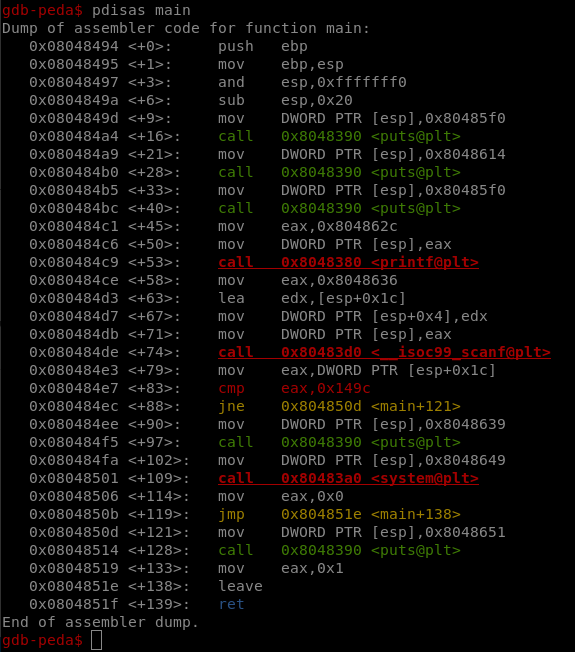
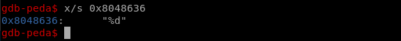

# Level00

## Setup

We find a binary file at the root of the user **`level00`** named *`./level00`*.

And we copy the file with `scp` *(OpenSSH secure file copy)*.
```bash
scp -r -P 4242 level00@<vm_ip>:/home/users/level00/level00 .
```

### Peda

```bash
./peda.sh level00
```

## Binary

We first tried to run the binary.
It asks for a password.
After trying a few random inputs, we only get an output stating "Invalid Password!", and it returns.

Time to disassemble!

### Source

```bash
pdisas main
```



We immediatly spot the `cmp` on the return of scanf, at main<+83>.

Is the password compared to a clear value in the code?

0x149c == 5276

And if we look at the format string sent to `scanf`?



In an equivalent program in C we should find something close to this:
```C
  scanf("%d", &pass);
  if ( pass == 5276 )
  {
    // do something
  }
```

We concluded that the developper reads a number from the user and expects it to equal `5276`.
And we tried exactly this.

### Solution

Connect with `ssh -p 4242 level00@<vm_ip>`
Enter the password `level00`

```bash
level00@OverRide:~$ ./level00 
***********************************
* 	     -Level00 -		  *
***********************************
Password:5276                         

Authenticated!
$ cat /home/users/level01/.pass
uSq2ehEGT6c9S24zbshexZQBXUGrncxn5sD5QfGL
```
